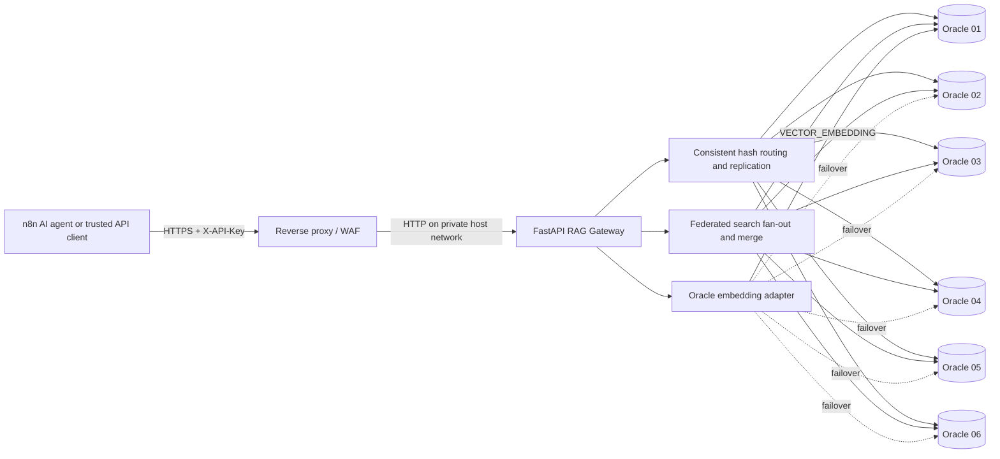

# RAG Gateway — Latest Project Context

Last updated: 2026-09-22 (Asia/Calcutta)

This is the current technical handoff for the Federated VectorDB Gateway (declared API
version `1.1.0`). It records what is implemented, what was verified live, how the six Oracle
databases are used, how n8n can integrate with the service, and what still blocks a
production-ready declaration.

Do not add API keys, database passwords, wallet material, or complete DSNs to this file.
The live values belong in a managed secret store or an ignored environment file.

## Contents

1. [Executive status](#1-executive-status)
2. [Latest verified live snapshot](#2-latest-verified-live-snapshot)
3. [System architecture](#3-system-architecture)
4. [Oracle database configuration](#4-oracle-database-configuration)
5. [Database schema](#5-database-schema)
6. [Data flow and consistency behavior](#6-data-flow-and-consistency-behavior)
7. [API surface and authentication](#7-api-surface-and-authentication)
8. [n8n integration](#8-n8n-integration)
9. [Configuration reference](#9-configuration-reference)
10. [Docker and deployment state](#10-docker-and-deployment-state)
11. [Production-readiness blockers](#11-production-readiness-blockers)
12. [Prioritized implementation plan](#12-prioritized-implementation-plan)
13. [Production acceptance checklist](#13-production-acceptance-checklist)
14. [Safe operational commands](#14-safe-operational-commands)
15. [Evidence boundaries](#15-evidence-boundaries)

## 1. Executive status

The gateway is **functionally working as a controlled single-instance RAG service**, but it
is **not production-ready for high availability, multi-tenant access, or critical data**.

Current headline status:

| Area | Current state |
| --- | --- |
| FastAPI gateway | Running and Docker-healthy |
| Oracle shards | 6 configured; 6/6 healthy in the latest live check |
| Vector storage | Working on all six Oracle Autonomous AI Databases |
| Embeddings | Oracle-hosted `ALL_MINILM_L12_V2`, 384 dimensions |
| Model hosted by gateway | No; Oracle executes `VECTOR_EMBEDDING` |
| Retrieval | Federated fan-out search across available shards works |
| Ingestion | Vector, batch, and chunked-document ingestion work |
| Replication | Consistent-hash placement, default RF=2 and write quorum=1 |
| Automated checks | 29/29 tests passed; Ruff check and format check passed |
| Container hardening | Non-root, read-only filesystem, all capabilities dropped |
| Suitable today | Development, staging, or trusted single-service pilot |
| Production verdict | No-go until the P0/P1 issues in this document are resolved |

Even if the operator intentionally accepts a broad Oracle network ACL, the data-integrity
and durability defects documented below independently prevent production sign-off.

## 2. Latest verified live snapshot

The following results were verified from the running environment on 2026-09-22:

- Container: `rag-gateway-gateway-1`
- Image: `rag-gateway-gateway`
- Published listener: `127.0.0.1:8000 -> 8000/tcp`
- Docker state: `healthy`
- `/ready`: `healthy_shards=6`, `unavailable_shards=0`
- `/admin/shards`: all `oracle_01` through `oracle_06` were configured, initialized,
  undrained, and had healthy circuit breakers.
- `/models/embedding` reported:
  - provider: `oracle`
  - model: `ALL_MINILM_L12_V2`
  - configured dimension: `384`
  - loaded dimension: `384`
  - initialized: `true`
  - hosted in gateway: `false`
  - active source at the time of the check: `oracle_01`
- Startup logs showed six initialized connection pools and successful Oracle embedding
  initialization.
- Earlier end-to-end checks in this working session successfully inserted, retrieved,
  searched, and cleaned up validation data across the six-shard service. RF=2 placement was
  exercised across all six databases.
- A non-destructive rebalance completed with 8 rows scanned, 11 replica writes, 0 failures,
  and 0 extra-row deletions.
- Temporary validation rows were cleaned up. At least one intentionally persistent demo
  document was left in the service.
- `pip check` reported no broken Python requirements.
- The running container was confirmed as user `gateway` with a read-only root filesystem.
- No CPU or memory limit is currently applied to the Compose container.

Latest test execution from the Docker audit image:

```text
29 passed, 1 deprecation warning
Ruff: all checks passed
Ruff format: 46 files already formatted
```

The test suite is primarily unit/mocked coverage. It is not a substitute for live Oracle,
failover, concurrency, migration, restore, or load testing.

## 3. System architecture



The gateway does not run or download a local embedding model. Text is sent over Oracle TLS
connections to an ONNX embedding model installed inside the configured Autonomous AI
Databases. Startup discovers or validates the model on the first usable preferred shard and
checks its output dimension. Runtime embedding calls prefer that source, then try other
available shards in order after a failure. Multiple texts are currently embedded
sequentially through one Oracle cursor, and the configured shard timeout is not wrapped
around the embedding SQL itself.

### Main modules

| Module | Responsibility |
| --- | --- |
| [`app/main.py`](app/main.py) | FastAPI lifecycle, middleware, routes, pool/model startup |
| [`app/config.py`](app/config.py) | Environment validation and six-shard configuration |
| [`app/database/pools.py`](app/database/pools.py) | Async Oracle pools and ping checks |
| [`app/database/oracle.py`](app/database/oracle.py) | Bound SQL for vector CRUD, search, scan, and schema data |
| [`app/embeddings/adapter.py`](app/embeddings/adapter.py) | Model discovery and `VECTOR_EMBEDDING` calls |
| [`app/router/consistent_hash.py`](app/router/consistent_hash.py) | Weighted consistent-hash placement |
| [`app/router/shard_registry.py`](app/router/shard_registry.py) | Shard health, circuit, weights, and drain state |
| [`app/search/fanout.py`](app/search/fanout.py) | Parallel search across available shards |
| [`app/search/merger.py`](app/search/merger.py) | Revision-aware deduplication and ranking |
| [`app/consistency/reconciler.py`](app/consistency/reconciler.py) | Point-read repair of missing/stale replicas |
| [`app/rebalancing/worker.py`](app/rebalancing/worker.py) | Online placement repair/rebalance |
| [`app/ingestion/chunker.py`](app/ingestion/chunker.py) | Overlapping document chunk generation |
| [`app/jobs/manager.py`](app/jobs/manager.py) | Process-local background operation tracking |
| [`app/middleware.py`](app/middleware.py) | Body limit, request IDs, metrics, optional rate limit |
| [`app/observability/metrics.py`](app/observability/metrics.py) | In-memory Prometheus-format counters |

## 4. Oracle database configuration

The logical shards are `oracle_01` through `oracle_06`. A shard is included only when its
complete `DBn_USER`, `DBn_PASSWORD`, and `DBn_DSN` triplet is present. A partial triplet is
ignored with a warning.

Latest known database facts:

- All six use the application user `VECTOR_APP`.
- All six were reachable and returned Oracle version `23.26.3.3.0` in the earlier complete
  six-shard probe.
- All six contained the required `VECTOR_ITEMS` schema and valid vector support.
- All six had the Oracle embedding model installed and working at 384 dimensions.
- Connections use walletless TLS (`tcps`, port 1522) with server-DN matching enabled.
- mTLS was last reported as disabled by the operator so the gateway can use
  username/password TLS without a downloaded wallet; this was not rechecked through an OCI
  management API.
- OCI ACL state was reported through the console, not verified through an OCI management API.

### Network rule for deployment

The Autonomous Database ACL sees the gateway server's **outbound public IP**, not its domain
name. A reverse-proxy hostname cannot be placed in an IP/CIDR ACL. For a deployed server:

1. Give the server a stable outbound public IP/NAT address.
2. Permit that IP as an individual IP rule, or use the provider's accepted CIDR notation.
3. Point the public domain to the reverse proxy.
4. Keep the FastAPI port private/loopback and let the proxy call it locally.
5. Allow outbound TCP 1522 from the gateway host to Oracle Autonomous Database.

The last operator-reported ACL included a broad `0.0.0.0/0` rule and a specific public IP.
That external setting must be rechecked directly in OCI before a security sign-off.

### User provisioning template

Use a unique secret for every environment and do not copy a password into documentation:

```sql
CREATE USER VECTOR_APP
IDENTIFIED BY "<STRONG_UNIQUE_PASSWORD>"
DEFAULT TABLESPACE DATA
TEMPORARY TABLESPACE TEMP
QUOTA UNLIMITED ON DATA;

GRANT DWROLE TO VECTOR_APP;
```

`DWROLE` and the quota allow the application user to create/use the schema and perform the
required insert, update, delete, and select operations. HTTP `POST`, `PUT`, and `DELETE`
authorization is still enforced by the gateway API keys, not by Oracle REST grants.
`DWROLE` is broad; a hardened deployment should use a separate migration identity and a
least-privilege runtime role after the exact required grants are established.

## 5. Database schema

The current clean-install schema is [`schema/001_create_vector_items.sql`](schema/001_create_vector_items.sql).

`VECTOR_ITEMS` contains:

- `namespace VARCHAR2(128)` and `id VARCHAR2(512)` as the composite primary key
- `chunk_text CLOB`
- `metadata_json CLOB` with an `IS JSON` constraint
- `embedding VECTOR(384, FLOAT32)`
- `revision NUMBER(20)`
- `content_hash VARCHAR2(64)`
- `document_id` and `chunk_index`
- created/updated timestamps
- document lookup index on `(namespace, document_id, chunk_index)`
- HNSW in-memory neighbor graph vector index using cosine distance and target accuracy 90

[`schema/002_add_consistency_and_documents.sql`](schema/002_add_consistency_and_documents.sql)
is only for installations created with the older schema. It is unconditional and is not an
idempotent migration.

There is currently no schema-version table, automated migration coordinator, or startup
validation of all columns and indexes on every shard.

## 6. Data flow and consistency behavior

### Vector write

1. The gateway validates `namespace`, text, metadata, and size limits.
2. It hashes `namespace:id` to an ordered list of shards.
3. It generates the embedding inside Oracle.
4. It generates a process-local nanosecond revision and SHA-256 content hash.
5. It writes to the first available intended replicas.
6. It returns success after the configured write quorum is reached.

Current defaults are replication factor 2 and write quorum 1. Therefore one successful copy
can be acknowledged as a successful write. The response exposes `replicas_written` and
`partial`, but there is no durable repair queue for an incomplete write.

### Point read

The gateway checks available placements, chooses the row with the newest numeric revision,
returns it, and schedules an in-process background read repair for missing/stale intended
replicas. `ETag`/`If-None-Match` is based on the content hash.

### Search

1. The query is embedded by Oracle.
2. Search fans out across every available shard.
3. Each shard returns cosine-distance candidates.
4. Results are deduplicated by `(namespace, id)` and prefer the newest returned revision.
5. Optional exact metadata filters, `max_distance`, and hybrid lexical reranking are applied.
6. The response states `searched_shards`, `unavailable_shards`, and `partial`.

Hybrid mode reranks vector candidates using lexical overlap. It is not a full-text recall
engine. Metadata filtering occurs after the per-shard candidate set is retrieved, so a strict
filter can miss matching rows that did not enter the oversampled candidate set.

### Document ingestion

Documents are split into overlapping character chunks. Each chunk is stored as a vector with
ID `<document-id>:chunk:<zero-padded-index>` plus `_rag_gateway` metadata describing offsets
and chunk count. The same API supports synchronous ingestion or process-local background
ingestion.

### Rebalance

The admin rebalance job scans rows, recomputes intended placements, and upserts missing
replicas. `delete_extras` defaults to `false`. Rebalance state and progress are not durable;
after a crash or restart, the operator must run it again.

## 7. API surface and authentication

Public routes:

- `GET /`
- `GET /live`
- `GET /ready`
- `GET /health`

All other routes require:

```text
X-API-Key: <gateway key>
```

Every `/admin/*` route additionally requires:

```text
X-Admin-API-Key: <separate admin key>
```

The keys are compared in constant time. The gateway key is one trusted service credential;
it does not identify tenants, and any holder can choose any namespace.

| Method and path | Purpose | Important behavior |
| --- | --- | --- |
| `POST /vectors` | Insert one vector | Duplicate `(namespace,id)` returns 409 |
| `PUT /vectors/{id}` | Upsert one vector | Uses Oracle `MERGE` |
| `POST /vectors/batch` | Embed/write a batch | Can return 207 with per-item failures |
| `GET /vectors/{id}?namespace=...` | Read newest observed copy | Schedules read repair |
| `DELETE /vectors/{id}?namespace=...` | Delete vector copies | Requires every shard available |
| `POST /search` | Federated semantic/hybrid search | Can return `partial: true` |
| `POST /documents` | Chunk/embed/store a document | `?background=true` returns operation ID |
| `GET /documents/{id}?namespace=...` | Return latest observed chunks | Merges copies across shards |
| `DELETE /documents/{id}?namespace=...` | Delete every chunk | Requires every shard available |
| `GET /operations/{id}` | Inspect background operation | State is process-local |
| `GET /models/embedding` | Inspect active Oracle model | Does not generate a new embedding |
| `GET /stats` | Pool/circuit status | Requires gateway key |
| `GET /metrics` | Prometheus text metrics | Requires gateway key |
| `GET /admin/shards` | Detailed shard/pool state | Requires both keys |
| `POST /admin/shards/{id}/drain` | Temporarily drain shard | Not persistent across restart |
| `POST /admin/shards/{id}/activate` | Reactivate shard | Not persistent across restart |
| `POST /admin/placement` | Preview consistent-hash placement | Read-only calculation |
| `POST /admin/rebalance` | Start placement repair | Background, non-durable |
| `DELETE /admin/namespace/{namespace}` | Delete a namespace everywhere | Destructive |
| `POST /admin/reinitialize` | Delete all vector data | Requires exact confirmation body |

API docs are disabled by default. When enabled, `/docs`, `/redoc`, and `/openapi.json` become
available and remain behind the normal gateway API key.

Client behavior must account for these response semantics:

- `partial: true` is degraded success, not proof that every intended replica was written or
  every shard was searched.
- HTTP 207 indicates a mixed-result vector batch.
- HTTP 202 indicates an accepted process-local background job that must be polled.
- HTTP 409 indicates an insert conflict for an existing `(namespace,id)`.
- HTTP 503 can mean no usable shard, an embedding failure, an unmet quorum, or a partially
  completed destructive operation.
- Do not blindly retry an ID-less `POST /vectors`; a retry generates another UUID. Supply a
  stable ID or add idempotency support first.

## 8. n8n integration

n8n can access the deployed service through the reverse-proxy domain. It does not need the
Oracle DSNs or database credentials.

Recommended separation:

- An ingestion workflow calls `POST /documents`.
- An AI-agent retrieval tool calls `POST /search`.
- The n8n agent passes the returned chunks to its LLM prompt.
- Administrative routes should not use the same n8n credential or general workflow.
- Store the gateway key in an n8n credential/environment secret, not directly in exported
  workflow JSON.
- Use stable document IDs and trusted namespace values.
- Inspect `partial`, `unavailable_shards`, `replicas_written`, 207 responses, and 503
  responses instead of treating every 2xx response as fully replicated success.

Example ingestion request:

```http
POST https://rag.example.com/documents
X-API-Key: {{$env.RAG_GATEWAY_API_KEY}}
Content-Type: application/json

{
  "id": "policy-2026",
  "namespace": "customer-a",
  "text": "<document text>",
  "metadata": {
    "source": "n8n",
    "type": "policy"
  },
  "replace_existing": false
}
```

Example retrieval request:

```http
POST https://rag.example.com/search
X-API-Key: {{$env.RAG_GATEWAY_API_KEY}}
Content-Type: application/json

{
  "namespace": "customer-a",
  "query": "What is the refund policy?",
  "top_k": 5,
  "ranking": "hybrid",
  "lexical_weight": 0.25
}
```

Document replacement exists through the same `POST /documents` route using the same document
ID and `replace_existing: true`, but it must not be treated as production-safe until the
non-atomic replacement defect below is fixed.

For a temporary pilot workaround, ingest under a new versioned document ID with
`replace_existing: false`, verify retrieval/search, switch the workflow's active reference,
and only then remove the old version. This reduces replacement risk but does not solve the
delete/read-repair race.

## 9. Configuration reference

The template is [`.env.example`](.env.example). Never commit the live `.env`.

Current resolved defaults/active values observed for settings not overridden by the live
container:

| Setting | Value |
| --- | ---: |
| API docs | disabled |
| Embedding provider/dimension | Oracle / 384 |
| Maximum `top_k` | 100 |
| Maximum text length | 100,000 characters |
| Maximum metadata size | 65,536 bytes |
| Maximum request body | 2,000,000 bytes |
| Maximum batch size/concurrency | 100 / 8 |
| Default chunk size/overlap | 1,200 / 200 characters |
| Maximum document chunks | 1,000 |
| Search candidate multiplier | 3 |
| Replication factor/write quorum | 2 / 1 |
| In-process rate limit | 0 (disabled) |
| Pool minimum/maximum/increment | 1 / 10 / 1 per shard |
| Pool acquisition wait | 5,000 ms |
| Shard query timeout | 10 seconds where applied |
| Circuit failure threshold/recovery | 3 failures / 30 seconds |

### Security and service

- `GATEWAY_API_KEY`: required for non-public routes; minimum 32 characters
- `ADMIN_API_KEY`: distinct admin key; minimum 32 characters
- `DOCS_ENABLED`: defaults to `false`
- `LOG_LEVEL`: defaults to `INFO`

### Embeddings and request limits

- `EMBEDDING_PROVIDER=oracle`
- `ORACLE_EMBEDDING_MODEL`: exact Oracle catalog model, or blank for discovery
- `ORACLE_EMBEDDING_SHARD`: optional preferred shard
- `EMBEDDING_DIMENSION=384`
- `MAX_TOP_K`, `MAX_TEXT_LENGTH`, `MAX_METADATA_BYTES`
- `MAX_REQUEST_BODY_BYTES`, `MAX_BATCH_SIZE`, `MAX_BATCH_CONCURRENCY`
- `DEFAULT_CHUNK_SIZE`, `DEFAULT_CHUNK_OVERLAP`, `MAX_DOCUMENT_CHUNKS`
- `SEARCH_CANDIDATE_MULTIPLIER`

### Placement and resilience

- `REPLICATION_FACTOR`: default 2
- `WRITE_QUORUM`: default 1
- `RATE_LIMIT_REQUESTS_PER_MINUTE`: default 0, which disables the limiter
- `DB_POOL_MIN`, `DB_POOL_MAX`, `DB_POOL_INCREMENT`, `DB_POOL_WAIT_TIMEOUT_MS`
- `SHARD_QUERY_TIMEOUT_SECONDS`
- `CIRCUIT_FAILURE_THRESHOLD`, `CIRCUIT_RECOVERY_SECONDS`

### Shards

Repeat for `n=1..6`:

- `DBn_USER`
- `DBn_PASSWORD`
- `DBn_DSN`
- `DBn_WEIGHT`

### Current configuration hygiene issues

The current ignored `.env` was inspected without printing values and contains:

- two `GATEWAY_API_KEY` assignments; only one unambiguous assignment should remain;
- `EMBEDDING_MODEL`, which the application does not read;
- no explicit `ORACLE_EMBEDDING_MODEL`, so the service currently auto-discovers the first
  Oracle embedding model.

Replace `EMBEDDING_MODEL` with `ORACLE_EMBEDDING_MODEL=ALL_MINILM_L12_V2` if deterministic
model selection is required. Keep passwords containing `$` in a separate `.gateway.env` and
use `GATEWAY_ENV_FILE=.gateway.env`; Compose's `format: raw` preserves literal secret text.
Do not also leave those secrets in Compose's automatically parsed project `.env`; rename the
current secret file or reduce `.env` to non-secret Compose variables.

## 10. Docker and deployment state

Current strengths:

- Python 3.11 slim runtime
- non-root `gateway` user
- read-only root filesystem
- `/tmp` tmpfs
- `no-new-privileges`
- all Linux capabilities dropped
- init process and `unless-stopped` restart policy
- host binding restricted to `127.0.0.1`
- healthcheck configured

Current limitations:

- one Uvicorn process and an architecture that is unsafe for multiple writers;
- no CPU, memory, PID, or log rotation limits;
- no included reverse-proxy/TLS/WAF configuration;
- no trusted-proxy/forwarded-header policy;
- access logging is disabled;
- base image is pinned to a moving tag rather than a digest;
- Python transitive dependencies are not locked with hashes;
- no SBOM, signed image, or automated vulnerability gate;
- Docker Scout CVE analysis was not completed because the local scanner required Docker
  account authentication.

For the intended deployment, terminate HTTPS at Nginx, Caddy, Traefik, or an equivalent load
balancer and proxy only to `127.0.0.1:8000`. Apply edge request/body limits and rate limiting.
If only n8n needs access, restrict the proxy or firewall to the n8n server's source network
where practical.

Until the P0 correctness work is complete, a limited pilot should run exactly one gateway
worker, avoid concurrent replacement/deletion, prefer versioned document IDs over in-place
replacement, and keep `delete_extras=false` during rebalance unless data has been backed up
and the replica plan has been independently verified.

## 11. Production-readiness blockers

### P0 — acknowledged upserts can be silently ignored

[`app/consistency/revision.py`](app/consistency/revision.py) generates wall-clock revisions
that are monotonic only inside one process. Multiple processes, different host clocks, or a
clock rollback can generate a revision lower than the row already stored. Oracle's `MERGE`
correctly refuses that older update, but [`upsert_vector`](app/database/oracle.py) does not
inspect the affected row count, and the API reports the write as successful.

Required outcome:

- use a globally safe revision/version strategy;
- return/check the Oracle `MERGE` result;
- report stale/conflicting writes instead of false success;
- add restart, clock-skew, and multi-writer tests.

### P0 — a deleted vector can be resurrected

Deletes physically remove rows and do not write a revisioned tombstone. A GET can schedule
read repair from a value it observed immediately before a concurrent DELETE. That repair can
run after the DELETE and upsert the old value again. A concurrent rebalance scan has the same
class of risk.

Required outcome:

- represent deletion with a revisioned tombstone;
- make read repair and rebalance propagate/respect tombstones;
- garbage-collect tombstones only after a safe retention window;
- add deterministic delete/read-repair and delete/rebalance race tests.

### P0 — document replacement is destructive and non-atomic

With `replace_existing: true`, the gateway deletes every existing chunk first and then writes
the new chunks independently. A crash or individual chunk failure after deletion leaves the
document missing or incomplete. Concurrent replacements can interleave.

Required outcome:

- write a new document generation without deleting the current generation;
- validate every new chunk/replica;
- atomically switch a document manifest/current-generation pointer;
- asynchronously remove the old generation after the switch;
- detect missing chunks from the stored expected chunk count.

### P1 — weak write durability and non-durable repair

RF=2 with W=1 acknowledges a write after one copy. A 503 after a quorum failure can also
leave committed minority writes because Oracle commits per shard and there is no cross-shard
rollback. There is no durable hinted handoff or periodic anti-entropy service.

Required outcome:

- decide and document the consistency contract;
- normally require W=2 for RF=2 when durability matters;
- persist incomplete-write repair work;
- make retries idempotent and expose a stable request/idempotency key;
- continuously reconcile replicas instead of relying only on point reads/manual rebalance.

### P1 — process-local jobs and cluster state

Background document jobs, rebalance progress, drain state, metrics, and revisions are held in
one process. A restart cancels jobs and loses their records. Multiple workers disagree on
drain state and cannot safely coordinate writes.

Required outcome:

- move jobs to a durable queue and persistent operation store;
- persist shard maintenance state and rebalance checkpoints;
- implement distributed coordination before adding gateway replicas;
- keep deployment at one gateway worker until this is complete.

### P1 — readiness and schema drift

`/ready` and `/health` return HTTP 200 when even one configured shard is usable. They do not
validate authentication configuration, write quorum capacity, the Oracle embedding model,
or schema/index compatibility. A shard pool that fails at startup is not recreated later.

Required outcome:

- distinguish process liveness, traffic readiness, and full-cluster health;
- require enough healthy shards for the configured write policy;
- validate model and schema version on every configured shard;
- retry/recreate failed pools;
- fail startup for incomplete production shard configuration.

### P1 — authorization and resource-exhaustion controls

One global gateway key can access every namespace. Public `/ready` and `/health` calls ping
all databases and bypass the in-process limiter. Rate limiting is disabled by default. The
in-memory rate/metrics maps can grow with attacker-controlled keys and paths. Background
jobs have no durable bounded queue.

Required outcome:

- derive permitted namespaces from a real service/tenant identity;
- keep deep health checks on an internal management path;
- apply a shared edge rate limiter and bounded internal data structures;
- cap active/background ingestion work and reject overload safely;
- use separate credentials/scopes for ingestion, retrieval, and administration.

### P1/P2 — release and operations gaps

- The workspace is not currently a Git repository.
- There is no CI/CD workflow or mandatory test gate.
- The Docker runtime build does not depend on the Docker test stage.
- There is no automated/live six-shard migration test.
- There is no load, soak, crash, clock-skew, or shard-failover test suite.
- There is no documented backup/restore procedure, RPO/RTO, or restore drill.
- Metrics are process-local and minimal; there are no alerts, dashboards, traces, or SLOs.
- Logs are plain text and request IDs are not consistently correlated into application logs.
- There is no managed-secret integration or rotation runbook.
- A database password was previously shared in conversation and must be rotated before any
  real production deployment.

## 12. Prioritized implementation plan

### Phase 1 — protect correctness

1. Implement revision-safe writes and verify affected row counts.
2. Introduce revisioned tombstones and make repair/rebalance deletion-aware.
3. Replace documents with versioned generations and an atomic manifest switch.
4. Add deterministic concurrency and crash tests for all three behaviors.

### Phase 2 — make recovery durable

1. Add a durable operations queue/store.
2. Persist repair, rebalance, and drain state.
3. Add idempotency keys and retry-safe write semantics.
4. Add scheduled anti-entropy and incomplete-replica repair.
5. Set the production write quorum according to the agreed durability contract.

### Phase 3 — production deployment controls

1. Add migration/version management and per-shard startup validation.
2. Add tenant/service authorization and credential rotation.
3. Add reverse proxy, HTTPS, WAF/shared rate limiting, resource limits, and log rotation.
4. Move secrets to a managed secret store and rotate every exposed credential.
5. Add structured logs, persistent metrics, tracing, dashboards, and alerts.

### Phase 4 — release proof

1. Put the project under Git version control.
2. Add CI for lint, formatting, unit tests, integration tests, image build, SBOM, and CVE scan.
3. Run live Oracle migration, six-shard failover, concurrency, load, and soak tests.
4. Define and test backups, coordinated restore, RPO, and RTO.
5. Perform a staged deployment and rollback drill before production traffic.

## 13. Production acceptance checklist

Do not mark the system production-ready until all applicable items are checked:

- [ ] Upserts cannot return success when Oracle ignored the revision.
- [ ] Deletes cannot be resurrected by read repair or rebalance.
- [ ] Document replacement is atomic from the reader's perspective.
- [ ] Quorum and partial-commit semantics are documented and tested.
- [ ] Background operations and repair work survive restart.
- [ ] Multiple gateway replicas are coordinated, or production explicitly remains single-writer.
- [ ] Every shard has an identical, versioned, validated schema and embedding dimension.
- [ ] Readiness reflects the actual configured write/read service level.
- [ ] Namespace authorization is enforced for every data route if multiple tenants use it.
- [ ] HTTPS, edge rate limits, resource limits, and trusted proxy settings are deployed.
- [ ] API, admin, and database credentials are rotated and stored outside the repository.
- [ ] OCI ACL and outbound server IP rules are reviewed in the actual deployment account.
- [ ] CI/CD, SBOM, vulnerability scanning, signed artifacts, and rollback are in place.
- [ ] Backup restoration and a full shard-loss scenario have been tested.
- [ ] Alerts, dashboards, logs, and on-call/runbook procedures exist.
- [ ] Load, soak, failure, concurrency, and clock-skew tests meet the target SLO.

## 14. Safe operational commands

These commands do not contain secrets. Run them from the project root.

Container status:

```powershell
docker ps --format "table {{.Names}}\t{{.Image}}\t{{.Status}}\t{{.Ports}}"
```

Public readiness:

```powershell
Invoke-RestMethod -Uri "http://127.0.0.1:8000/ready" -Method Get
```

Run the test stage:

```powershell
docker build --target test --tag rag-gateway:test .
docker run --rm rag-gateway:test python -m pytest -p no:cacheprovider
docker run --rm rag-gateway:test python -m ruff check .
docker run --rm rag-gateway:test python -m ruff format --check .
```

Read-only Oracle capability probe for one shard:

```powershell
docker compose run --rm gateway python scripts/oracle_probe.py --shard 1
```

Repeat `--shard 1` through `--shard 6` when validating a deployment. The probe performs
reads and an embedding smoke query; it does not insert, update, or delete rows.

Start with a separate raw secret file when passwords contain `$`:

```powershell
$env:GATEWAY_ENV_FILE = ".gateway.env"
docker compose up --build -d
```

## 15. Evidence boundaries

Verified directly in the latest audit:

- running container state and hardening flags;
- public readiness and authenticated shard status;
- Oracle embedding model status;
- recent startup logs;
- unit tests, Ruff checks, and Python dependency consistency;
- repository source, schema, configuration names, and Docker definitions.

Not independently verified through cloud-management APIs:

- current OCI ACL entries and whether they have changed since the console screenshots;
- Autonomous Database backup retention and restore readiness;
- external reverse proxy, DNS, TLS certificate, firewall, or WAF configuration;
- current credential rotation status;
- a complete current image CVE report.

Whenever infrastructure or code changes, update the date and verified snapshot in this file
rather than treating historical results as permanently true.
